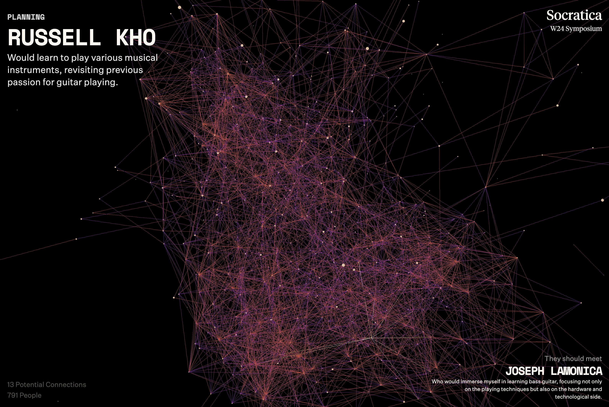
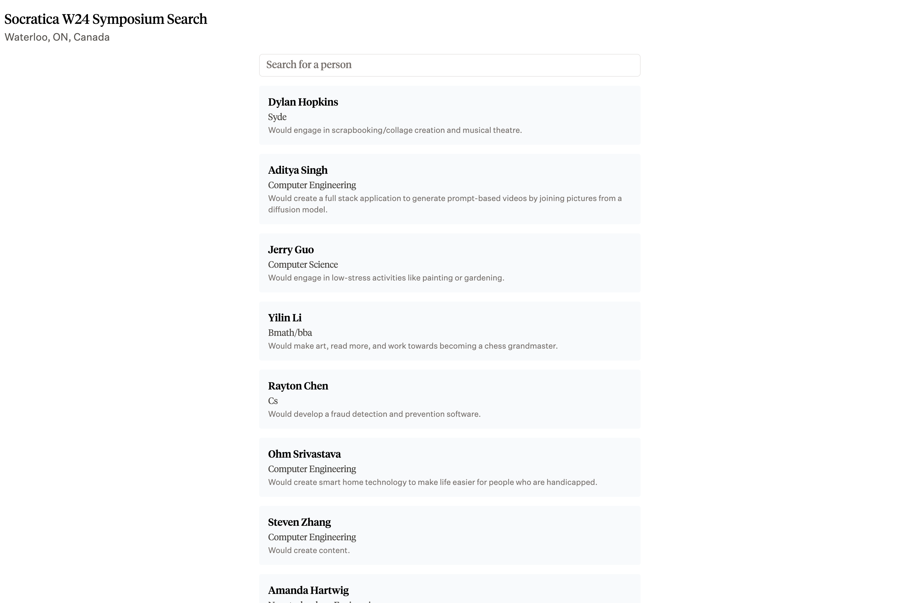

# Matchmaking Tools

### Download participant data

In lu.ma, go to your event page and click "Manage". Click "Guests" and click the download button to get the CSV file. Put this in the root directory of this repository as "**data.csv**"

If you have your own CSV, format it as follows:

| Names               | Responses                                     |
| ------------------- | --------------------------------------------- |
| Freeman Jiang       | I wish to explore the world                   |
| Rajan Agarwal       | I want to build AGI                           |
| Hudhayfa Nazoordeen | I want to grow more vegetables hydroponically |

In `generate_embeddings.py`, set the `COLUMN_INDEX` to be the column that your responses are in. For example, In the above csv the index would be `1`.

### Running the script

Install dependencies

```sh
python3 -m venv venv
source venv/bin/activate
pip install -r requirements.txt
```

Generate embeddings

```sh
python generate_embeddings.py
python build_graph.py # to create the graph based on the distance threshold
python attendees.py # to create initial cache
```
You should now successfully have a `graphData.json` file. You now have the option to summarize each response. For example, 

> i want to learn how to sculpt/pottery! creating something from a block of clay would be incredible but would take a lot of time/lessons.

would become 

> Would learn how to sculpt and create pottery from clay. 

We recommend this for events where you can search for people, using the `match` site. If you are just using the graph, this is not necessary.

```sh
python summarize_graph_data.py # (OPTIONAL) to summarize responses with LLM
```

If you choose to summarize the data with an LLM, a `summarizedGraphData.json` file will be present too. If you do the AI summarization, change `ai_summarization` in `attendees.py` to True. Then, run attendees again to recache.

```sh
python attendees.py # create attendees.json for searching
```

## Developing the Graph



In the **graph/** directory

```sh
cd graph
pnpm i
pnpm run dev
```

For Tailwind, concurrently:

```sh
pnpm run tailwind
```

Then open **graph/index.html** in a browser.

To serve:

```sh
pnpm start
```

## Developing the Matchmaking Site



Now in the **match/** directory

```sh
cd match
pnpm i
pnpm run dev
```

Then open **localhost:3000** in a browser.

To serve:

```sh
pnpm start
```
